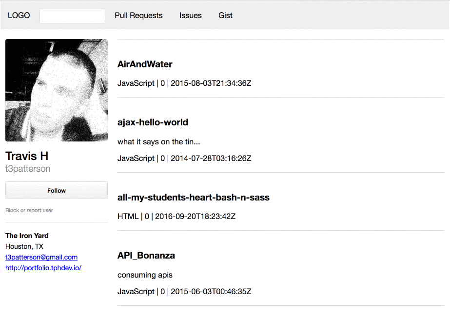
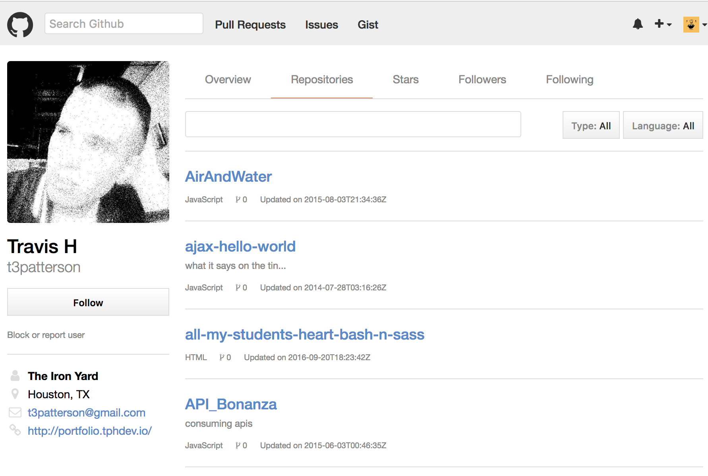

# Github Clone

## Objectives

After completing this assignment, you should be able to:

* Demonstrate use of Promises and AJAX methods
* Demonstrate ability to update DOM elements and their attributes/innerHTML via JS
* Create an event listener for an input element.  
* Utilize routing and a controllerRouter() function to simplify your navigation code.


## Deliverables

* A repository on github
* Site styles written in SCSS in the `src/`  and compiled to the dist
* JS written in `src/` and compiled to the dist folder
* Import/Export es6 modules
* Client-side routing that listens to the 'hashchange' event and renders new data
* Successful AJAX requests from the Github API

## Details

## Normal Mode

#### Part 1
Recreate the HTML and CSS for the Github tab page (https://github.com/matthiasak?tab=repositories) as your design, and using two AJAX requests/Promises, pull your own profile information from Github:

- Your profile: `https://api.github.com/users/«username»`
- Your repos: `https://api.github.com/users/«username»/repos`

After loading data from the Github API, write at least the following information to the DOM:

- name
- blog
- location
- email
- an `` with its source as the avatar_url
- html_url
- for each repo that belongs by your user, create an html-component

#### Part 2
You will also need to include an `<input>` tag on your page that will allow users to search for a particular GitHub account. Once the user presses enter in the `<input>` tag, your app should change the hash, which will trigger a new request to the GitHub server, and display information for the corresponding user.

### Demo
####Functionality


####Design



## Setup Instructions

1. In `~/muktek/labs`,
2. Clone **[webpack-simple-serve](https://github.com/t3tools/webpack-simple-server)** repo to a folder called `github-clone`:
  ```
  git clone git@github.com:t3tools/webpack-simple-server.git
  ```
3. Remove the remote repo pointer and create your own remote.
  ```
  git remote remove origin
  hub create
  ```
4. Install project dependencies
  ```
  yarn
  ```
5. Start the local server
  ```
  npm run go
  ```


---

### API Notes

Docs: https://developer.github.com/v3/

1. [Get an API key](https://github.com/settings/tokens/new)
  - Click 'Generate Token', leave all options *unselected*
2. Copy the access token
  - You won't be able to see it again from github!
3. At the root of your project directory, create a `secrets.js` file. Inside of it, export your githubApiKey:
  ```
  export const githubApiKey = '«your github access token»'
  ```
4. In your `app.js`, import your `githubApiKey`
  ```
  import { githubApiKey } from '../../secrets.js'    
  ```
5. Make sure you can fetch a user from the API with your token
  - https://api.github.com/users/t3patterson?access_token=«your-access-token»

Why all of this? Github puts a rate limit on unauthenticated requests to their API at 60 per hour *per IP address*. As a class, we will be sharing the same IP address on campus, and will exceed this threshold quickly. Therefore, we need an api key for our application (i.e. an access token).

Normally we would put our api key in a variable in `app.js`, but if we do that _Github will detect the key and delete it_ because it is usually very bad practice to push an access token to a public repository. The solution is to put our api key in a file we are hiding from version control (`secrets.js` in `.gitignore`). With these steps above, we can import the api key from another file locally without having the key getting invalidated when we push our code up to github.  


### Roadmap to Success
1. Import jQuery, and successfully fetch user profile data + repo data for your github profile in your `app.js`

2. In the promise-handler, render a minimal amount of data to the page. Note: you may want to use `$.when(...)` to resolve multiple promises. [Example of progress](./demos/roadmap-step2.png)

3. Create a simple layout in HTML + CSS for the layout per the mockup -- initially build it with static hard-coded HTML to make sure that the elements are mostly in place.

4. Create a function that builds the html dynamically and returns an output string. To build the html-string, the function should accept 2 arguments, one argument for the user profile data, another argument for the repo data. The function should execute inside the promise-handler when the repo + user data has returned and it put the html-string inside `div id='app-container'`. [Example of progress](demos/roadmap-step4.png)

5. Create the `controllerRouter()` function. The function should get the current value in the `window.location.hash`.
  + If there is a value for a github user in the hash, it should execute the fetches for the profile data and repo data,
  + if there is no value in the hash it should fetch + return the default github profile (i.e. your profile).

  When the data returns, do the same as the previous step (i.e. creating an html-string from the profile + repo data that you will put as innerHTML to `app-container`).

6. Add an eventListener that listens for the `hashchange` event type on the `window`. The callback function should be the `controllerRouter` -- the controllerRouter which will check what's in the hash, fetch the user profile/repo info, and render to the page. [Example of progress](demos/roadmap-step5.gif)

7. After rendering the html to the page, put an event listener on the `<input>` tag in the navbar. It should listen for the enter-key and update the hash with whatever value is in the input -- if you've done steps 5 & 6, the user's data in the `<input>` should fetch + render to the page.  [Example of progress](demos/roadmap-step6.gif)

8. Fine tune your styles. [Example of progress](demos/roadmap-step7.png)
